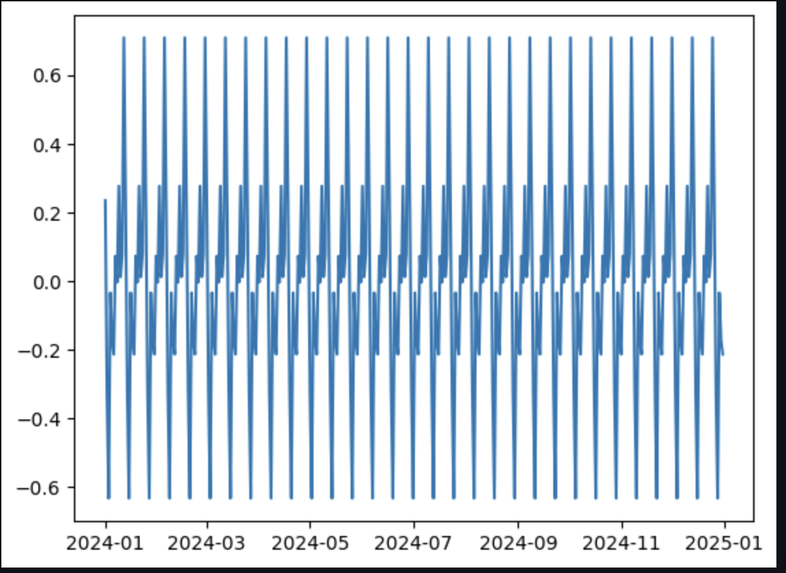
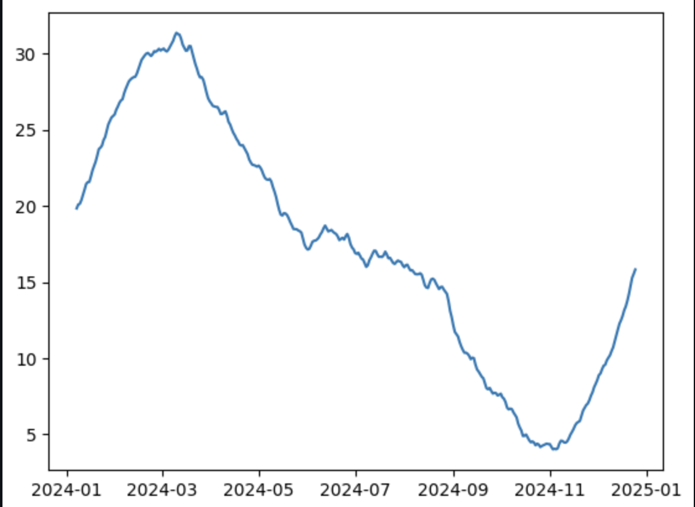
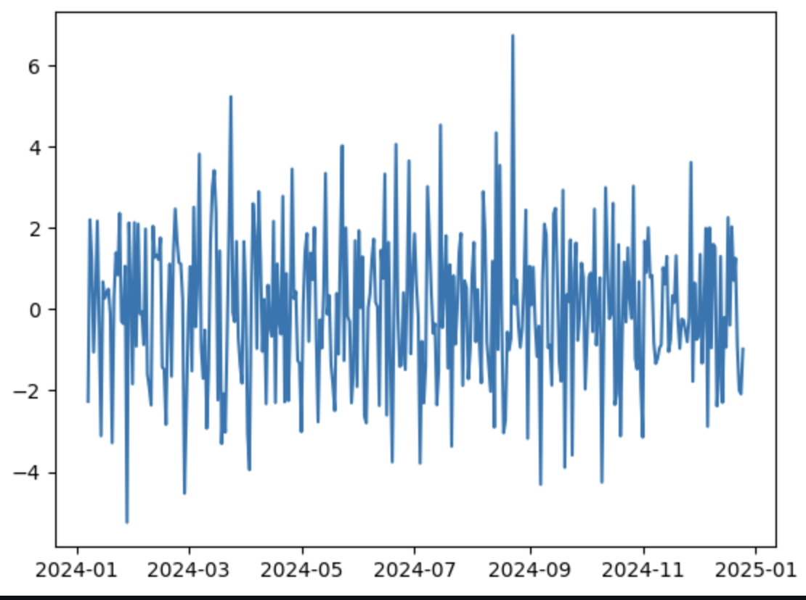

# Ex.No: 05  IMPLEMENTATION OF TIME SERIES ANALYSIS AND DECOMPOSITION
### Date: 23/03/2024

### AIM:
To Illustrates how to perform time series analysis and decomposition on the monthly average temperature of a city/country and for airline passengers.

### ALGORITHM:
1. Import the required packages like pandas and numpy
2. Read the data using the pandas
3. Perform the decomposition process for the required data.
4. Plot the data according to need, either seasonal_decomposition or trend plot.
5. Display the overall results.

### PROGRAM:

```py
!pip install pandas
import pandas as pd
import matplotlib.pyplot as plt
data = pd.read_csv('/content/time_series_data.csv')

data['date'] = pd.to_datetime(data['date'])
data.set_index('date', inplace=True)

period = 12

result = seasonal_decompose(data, model='additive', period=period)

plt.plot(result.trend)

plt.plot(result.seasonal)

plt.plot(result.resid)
```

### OUTPUT:
#### SEASONAL PLOT REPRESENTATION :



#### TREND PLOT REPRESENTATION :


#### Residual REPRESENTATION:



### RESULT:
Thus we have created the python code for the time series analysis and decomposition.
